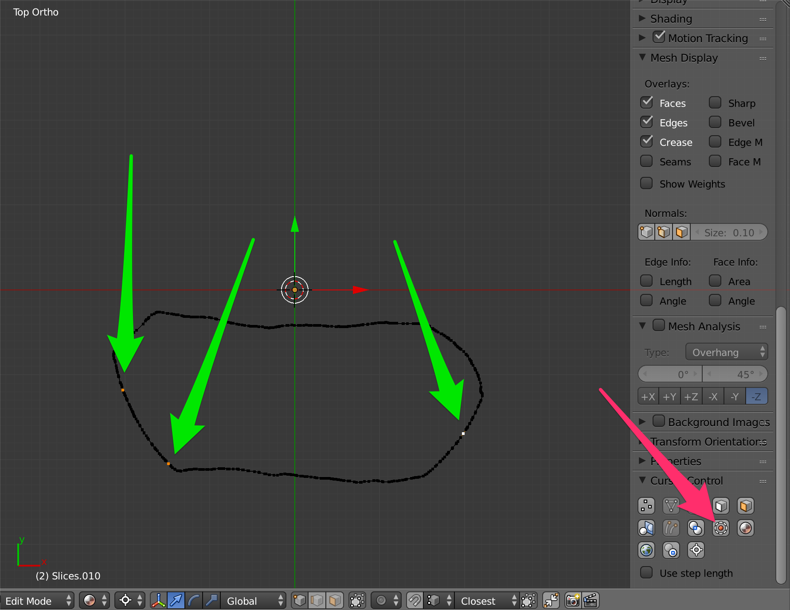

# BlenderAddons4CH

Blender add-ons for Cultural Heritage — a curated list of tools useful for documentation, modelling, photogrammetry, point clouds and visualization in CH workflows.

> **Link status:** all links were verified on **2026-06-09**. Entries whose original link was dead are marked with ⚠️ and, where possible, point to the current home of the tool.

## Table of contents

1. [Sites where to find add-ons](#sites_addons)
    1. [Official Blender add-ons](#sites_official)
2. [Texture painting](#texture_painting)
3. [Vertex painting](#vertex_painting)
4. [Sculpting](#sculpting)
5. [Materials](#materials)
6. [PBR materials and the FOSS ecosystem around Blender](#pbr_materials)
7. [Speed up modelling and procedural modelling](#speedup_modelling)
8. [UV mapping tools](#uv_mapping)
9. [Enhance the 3D viewport interface](#interface_3d)
10. [Baking tools](#baking_tools)
11. [Photogrammetry, point clouds and 3D Gaussian Splatting](#photogrammetry)
12. [Compositor](#compositor)
13. [Multi-user](#multi_user)
14. [Landscape management](#landscape)
15. [Camera and rendering (static and video)](#camera_rendering)
16. [Animation](#animation)
17. [Connection to external libraries](#external_libraries)
18. [Coding](#coding)
19. [Beautiful themes for Blender](#themes)
20. [Startup file and configuration](#startup_file)
21. [Paid / commercial add-ons](#paid)
22. [Simulation](#simulation)
23. [Exporter / Importer](#exporter_importer)
24. [2D plans and sections: derived-data creation](#derived_data)
25. [BIM / HBIM (Building Information Modelling for Heritage)](#bim_hbim)

## 1. Sites where to find add-ons 

### Official Blender add-ons 

- [Blender Extensions Platform](https://extensions.blender.org/) — the official, current source for Blender add-ons (replaces the old `wiki.blender.org/Extensions:2.6`, which is now offline).
- [Blender Add-on List](http://blenderaddonlist.blogspot.it/) — collection with animated GIF descriptions and external download links (now largely outdated).
- [GitHub search: Blender + Python](https://github.com/search?l=Python&q=blender&type=Repositories&utf8=%E2%9C%93) — keyword-based search (1700+ add-ons).
- "12 useful Blender add-ons everyone should use" (blenderguru.com) — ⚠️ original article dead (June 2026).

## 2. Texture painting 

- **Brush library manager**: [Download](https://www.dropbox.com/s/2tr64y6w7sgolr7/vtools_libraryManager.py?dl=0)
- **Texture from Image**
- **Texture Paint Plus**: originally written by Bart Crouch (author of the Sketchfab exporter, among other things) and later extended by two more artists/developers. A useful tool for painting in Blender. [Download](https://github.com/artistCDMJ/texture_paint_plus/archive/master.zip)
- **Texture Presets**: handy add-on for quickly creating images at known power-of-two sizes (1024 / 2048 / 4096).
- **Zero Brush**: old version (when the stand-alone version was still free; nowadays you need the whole Sensei-free pack, which is VERY invasive).
- **Brushes**: brushes to import in "append" mode from the included blend file. [Download](https://github.com/xrg81/brushes)

## 3. Vertex painting 

- **Oscurart Worn Edges**: add-on for painting per-vertex color on meshes at wear areas of a model (exposed edges, etc.). Great for creating wear maps.
- **Slope**: replaces the active vertex group or vertex-color layer with values representing the slope of a face (now also available in BlenderGIS). A "version 2" of the same also exists (?).
- **Transpal**: brilliant tool for vertex painting based on visual rules and palettes (also from GIMP).

## 4. Sculpting 

- **Sculpt Brushes**: handy collection of sculpting brushes (installed inside Blender and enabled with a button).
- **Space View Brush**: with Alt+V you get all sculpting commands at hand.

## 5. Materials 

- **Matalogue**: [Website](http://adaptivesamples.com/2015/08/04/introducing-matalogue/)
- **Display Material Relations**
- **Material Converter**: converts materials from Blender Internal (including GLSL materials such as Photoscan ones) to Cycles. Deprecated in recent versions; it can be found in Blender Sensei and in the paid add-on Zero Brush (listed here in its old, free version under "Texture painting").

## 6. PBR materials and the FOSS ecosystem around Blender 

- **Real-time visualization and editing of PBR materials**: the Blender PBR branch by Clément Foucault — [clement-foucault.com](http://www.clement-foucault.com/). This work was long ago merged into Blender (it became EEVEE).

Materials / PBR shaders:
- easyPBR shader — ⚠️ original link (cgcookiemarkets.com) dead, the CG Cookie marketplace closed (June 2026).
- UE4 Shader
- Shader Library
- PBR material inspired by the Substance material editor (works well with any metallic-roughness pipeline)
- PBR Node v1.5
- A PBR setup made by me following Cynicat
- **Blender Brit** (following tips from Cynicat and Blender Guru): [blenderbrit.co.uk](http://www.blenderbrit.co.uk/free-tool-pbr-node-pack/)
- **Mega Shader** by Stefano Scarioni, CC-BY — ⚠️ original link dead (June 2026).
- Bachelor's thesis on PBR in Blender — Sairiala, 2015, *PBR workflows in Cycles Render Engine*.

**FOSS ecosystem around Blender to improve the paint/sculpt/PBR pipeline:**
- **xNormal** — open source; efficient baker from high-poly to low-poly for MANY map types (WIN). A bit slow (the CUDA option that should make it VERY fast crashes for me).
- **AwesomeBump** — open source; lets you process metallic and roughness maps (PBR-metallic flavour) automatically or semi-automatically (MAC, WIN, LINUX). Crashes with 8192 maps :-( — now at [github.com/kmkolasinski/AwesomeBump](https://github.com/kmkolasinski/AwesomeBump) (the old `awesomebump.besaba.com` is offline).
- **Luminance HDR** (formerly qtpfsgui) — open source; useful for making HDR from panoramas with different exposures (MAC, WIN, LINUX).

These provide open parallels to closed-source software solutions for improving the PBR pipeline.

## 7. Speed up modelling and procedural modelling 

- **np_station**: [Forum thread](https://blenderartists.org/t/addon-np-station/686462)
- **Cutaway material** (for sectioning): [Blog post](https://blendbits.blogspot.it/2017/02/the-cutaway-shader-free-blender-add-on.html)
- **Mesh Align Plus**: [Releases](https://github.com/egtwobits/mesh-align-plus/releases)
- **Selective Unhide**: [GitHub](https://github.com/RayMairlot/Selective-Unhide)
- **Snap Advanced**
- **Drop to Ground**: drops selected objects onto the active object.
- **Planarizer**: corrects non-planar quads / coplanarizes the selected faces (based on the faces' median normal).
- **Rotation Constrained**

- **Circumferences from three points**

- **Object Cross Section**: creates cross-section(s) of the selected object(s) using the active object as the cutting plane.
- **Laser Slicer 0.7**: makes a series of cross-sections and exports an SVG file for laser cutting.
- **Intersection**: adds to the active object's mesh its intersection with another mesh object.

Retopology / hard-surface modelling:
- **Box Cutter**: [Update notes](https://masterxeon1001.com/2016/05/28/box-cutter-4-update-notes/)
- **Blender Carver**
- **Blender Rebool**
- **Booltron** (Boolean add-on)
- **Bool Tool**: tool for direct booleans as well as via modifier (not super useful..). [Code](https://github.com/vitorbalbio/code)
- [Calculating distances between two points using geodesic paths](http://www.blendernation.com/2016/03/03/calculating-distances-two-points-using-geodesic-paths/)
- **Sverchok**: very powerful node system for procedural modelling. [GitHub](https://github.com/nortikin/sverchok)
- **Floorboard generator**: generates floorboards.
- **Modular Tree**: great add-on for creating procedural trees; now in its third version. [Releases](https://github.com/MaximeHerpin/modular_tree/releases)

## 8. UV mapping tools 

- **TexTools for Blender**: [Bitbucket](https://bitbucket.org/renderhjs/textools-blender/)
- **Sure UV**: tool for quick UV mapping for architecture. [Blender developer file](https://developer.blender.org/F18724), [forum thread](http://blenderartists.org/forum/showthread.php?236631-Addon-Simple-Box-UVW-Map-Modifier)
- **Magic UV**: nice tool for editing UVs; an interesting feature is the bounding box in UV space. [GitHub](https://github.com/nutti/Magic-UV)
- **Move UV**: move UVs from the 3D view.
- **UV Squares**: [GitHub](https://github.com/Radivarig/UvSquares/), [video](https://www.youtube.com/watch?v=oklmDQx17HI&feature=youtu.be)
- **Multi-Object UV Editing**: Texture Atlas does this too, but this one is more "direct". [GitHub](https://github.com/ndee85/Multi-Object-UV-Editing)

## 9. Enhance the 3D viewport interface 

- **Mesh Snap Utilities Line**
- **Screencast**
- **Various tools** including a Modifier Manager
- **Enhanced 3D Cursor**
- **Shading menu in header**
- **MeasureIt**: [Blender Extensions](https://extensions.blender.org/add-ons/measureit/) — now bundled with Blender (Edit ▸ Preferences ▸ Add-ons). The old `Antonioya/blender/measureit` path is gone, but the [author's repo](https://github.com/Antonioya/blender) still exists.
- **Add Dimension**: sets the length of an edge arbitrarily.
- **Amaranth Toolset**: [Blender Extensions](https://extensions.blender.org/add-ons/amaranth/) (the old `pablovazquez.org/amaranth` page is dead).
- **Rename**
- **Vertex Index Viewer**: ⚠️ original Blender-wiki link dead; equivalent functionality is now built into Blender (enable *Developer Extras* and the index overlays).
- **Is Key Free**: finds an unused key for a shortcut.
- **Apply Shape Keys**
- **Miscellaneous tools**: [github.com/lapineige/Blender_add-ons](https://github.com/lapineige/Blender_add-ons.git)

## 10. Baking tools 

- **Multibake**: bakes the selected object into individual maps.
- **Meltdown**: improved baking UI.
- **Texture Atlas**: among the authors is Campbell Barton (not sure whether it's in the official Blender version — I hope so).

## 11. Photogrammetry, point clouds and 3D Gaussian Splatting 

> This is the core section for Cultural Heritage 3D workflows. The three highlighted areas — **photogrammetric import**, **point-cloud import** and **3D Gaussian Splatting** — were all re-verified on 2026-06-09.

### Photogrammetry import

- **Blender-Addon-Photogrammetry-Importer** (SBCV) — ✅ **actively maintained** (1.3k★, latest release Feb 2026, Blender 5.0.2+). The reference tool for importing photogrammetric reconstructions. Imports cameras and point clouds from **Agisoft Metashape, COLMAP/GLOMAP, Meshroom, MVE, Open3D, OpenSfM, OpenMVG, Regard3D and VisualSFM**, and reads point clouds in PLY/PCD/LAS/LAZ/ASCII (with OpenGL or Geometry Nodes representation). [GitHub](https://github.com/SBCV/Blender-Addon-Photogrammetry-Importer)
- **3DSC** (3D Survey Collection)
- **QuipCAM**: Blender OSL shader to model 360° panoramas inside the 3D space.
- **Import Bundler 0.3 format**: imports the `bundle.out` file produced by Bundler (a modified version of mine also keeps the camera names — made for Enzo).
- **Panorama Tracker**: tool for stabilizing 360° videos. [GitHub](https://github.com/dfelinto/Panorama-Tracker)

### Point-cloud import

- **Point Cloud I/O** — ✅ **recommended modern importer**. Imports/exports E57, PLY, LAS/LAZ, PCD, XYZ and PTS into Blender's native PointCloud object (colors, normals, intensity, classification become point attributes usable in Geometry Nodes). Handles million-point datasets. [Blender Extensions](https://extensions.blender.org/add-ons/point-cloud-io/)
- **Blender-Import-Point-Cloud-Addon** (SBCV) — imports PLY files as point clouds; from the same author as the Photogrammetry Importer. [GitHub](https://github.com/SBCV/Blender-Import-Point-Cloud-Addon)
- **io_mesh_xyz** *(legacy)*: imported/exported a file of position triplets to generate a point cloud — ⚠️ original Blender-wiki link dead (June 2026). Use **Point Cloud I/O** above instead.

### 3D Gaussian Splatting (3DGS)

- **3DGS Render by KIRI Engine** — ✅ **recommended (current)**. Free, full Gaussian-Splat editing and rendering suite (v5.x): imports/edits/renders 3DGS `.ply`, integrates with EEVEE (the only tool with this), supports rigging splats from a proxy mesh and exporting animated 4DGS as `.ply` sequences. Blender 5.1+. [GitHub](https://github.com/Kiri-Innovation/3dgs-render-blender-addon)
- **Gauss Cannon** (Arash Keshmirian) — ✅ GPL-3, Blender 4.2+. Automates the capture side of 3DGS: places cameras at mesh face centers, ray-traces a point cloud and exports camera paths/point clouds to reconstruction tools (Postshot, Lichtfeld Studio). Useful to generate synthetic training data from a Blender scene. [GitHub](https://github.com/keshmirian/gauss-cannon)
- **gaussian-splatting-blender-addon** (ReshotAI, added 2024-03-05) — ✅ still online (578★). Imports a 3DGS dataset and creates visualizations; useful to clean floaters, but the author notes it is experimental and slow on large scenes. [GitHub](https://github.com/ReshotAI/gaussian-splatting-blender-addon)

## 12. Compositor 

- **Blender Quick Compositor**: tools for rapid compositing in Blender. [Website](http://www.blenderbrit.co.uk/quickcompositor/)
- **EasyFX**: excellent tool for post-processing freshly rendered images. [Download](http://www.rymdnisse.net/download/blender-addons/easyfx/)
- **Photo Editing Tool**: use nodes to edit images inside Blender (extra panel in the compositor).
- **Color Ramp Dropper**: clever system to sample a series of color values for a color ramp from an image. [Forum thread](https://blenderartists.org/forum/showthread.php?401806-Addon-v1-2-ColorRamp-Dropper-easily-select-color-values-for-ColorRamp-nodes&p=3071567#post3071567), [GitHub](https://github.com/qwenger/BAddons/tree/master/Node_ColorRampDropper)

## 13. Multi-user work in Blender 

- **Verse 2**: server + client to model remotely in the same 3D space. [GitHub](https://github.com/verse/verse-blender)

## 14. Landscape management 

- **BlenderGIS**: [GitHub](https://github.com/domlysz/BlenderGIS.git)
- **Vegetation (grass)**: [3d-wolf.com/grass](http://www.3d-wolf.com/grass.html) — ⚠️ companion Google Doc no longer available (June 2026).
- **LOD generation for terrains**: [hugobarreira.weebly.com](http://hugobarreira.weebly.com)
- **Sun Position**
- **OSG Export**: [GitHub](https://github.com/cedricpinson/osgexport)

## 15. Camera and rendering (static and video) 

- **Real Camera**: effects for realistic rendering. [3d-wolf.com](https://3d-wolf.com/products/camera.html)
- **CameraImagePlane**: script to create a projection plane in the camera.
- **Advanced Boomsmash** (OpenGL viewport video) — ⚠️ original link dead (June 2026).
- **Orbit camera**: script to create a camera that rotates around an object. [github.com/Antonioya/blender](https://github.com/Antonioya/blender)

## 16. Animation 

- **Blender Power Sequencer**: adds essential tools to Blender's video sequencer for editing videos efficiently. [GitHub](https://github.com/GDquest/Blender-power-sequencer.git)
- **Animation Nodes**: great add-on that adds a node-based animation system (excellent). [GitHub](https://github.com/JacquesLucke/animation_nodes)
- **Keyframes Quick Tools**
- **Flip Animation**
- **VSE logging system**
- **Particle morphing tools** (deprecated in recent versions)

## 17. Connection to external libraries 

- **Blender Cloud textures**: add-on to use Blender Cloud textures out of the box (requires a Blender ID account and subscription).
- **Blend Library**: ⚠️ original Blender-wiki link dead; this functionality is now largely covered by Blender's built-in **Asset Browser**.

## 18. Coding 

- **XML Importer**
- **Code Autocomplete**: great add-on for developing add-ons. [Release](https://github.com/JacquesLucke/code_autocomplete/releases/tag/code_autocomplete_v2a)

## 19. Beautiful themes for Blender 

*(empty — contributions welcome)*

## 20. Startup file and configuration 

To be copied into `C:\Users\[USER]\AppData\Roaming\Blender Foundation\Blender\[VERSION]\config`.

## 21. Paid / commercial add-ons 

- **ProLightSkies**: great for photorealistic outdoor lighting.
- **Color Master**: great add-on for color correction; has a rich thumbnail section for quick previews of configurations.
- **RetopoFlow**: fantastic (and expensive) add-on for retopologizing geometry. Excellent; comes with a set of tutorials (+300 MB).

Added 14 December 2016:
- **Asset Sketcher**: add-on that lets you paint geometry onto other geometry (e.g. trees on terrain), speeding up the workflow.
- **Baketools**: advanced baking tools that make the task fast and precise.
- **Eibriel Linker**: add-on to manage linked assets; good but needs its own particular setup. The developer is a bit dormant (I've been asking for features for months..).
- **Gaffer**: FANTASTIC tool for light tuning.
- **Lodscape**: immature but useful system for creating automatic levels of detail in landscapes (works with topologically correct meshes, e.g. created from DEM or Instant Meshes).

Other commercial tools worth noting:
- Great skin material pack (photorealistic).
- Great add-on for editing a geometry's UVs.
- Paints vertex weights based on rules.
- Ingenious system for levels of detail inside Cycles (fantastic scene optimization).
- **Capsule**: lets you export groups of objects to FBX following rules.
- Great add-on to visualize geometry hidden behind other geometry (fantastic during polygonal editing of objects).
- Shader for Allegorithmic (Substance).
- **BPainter**: monumental painting add-on for Blender.

## 22. Simulation 

- **Modeling-Cloth**: great add-on for modelling and simulating cloth. [GitHub](https://github.com/the3dadvantage/Modeling-Cloth)
- **Projectors** (Ocupe): great add-on to simulate projection onto surfaces in 3D space. [GitHub](https://github.com/Ocupe/Projectors)

## 23. Exporter / Importer 

- **glTF Blender Exporter**: [GitHub](https://github.com/KhronosGroup/glTF-Blender-Exporter) (note: glTF import/export is now built into Blender).
- **FBX Bundle**: ⚠️ original link (`renderhjs.net/fbxbundle`) offline; the tool moved to Superhive / Blender Market.

## 24. 2D plans and sections: derived-data creation 

- **MeasureIt_ARCH**: an add-on for Blender that adds tools to create design documentation and technical drawings, which can be previewed in Blender's 3D viewport and exported as images, vector graphics or `.dxf` files. [GitHub](https://github.com/kevancress/MeasureIt_ARCH?tab=readme-ov-file)

## 25. BIM / HBIM (Building Information Modelling for Heritage) 

- **Bonsai** (formerly **BlenderBIM Add-on**) — ✅ **the reference FOSS tool for OpenBIM in Blender**, highly relevant for **HBIM** (Heritage BIM). A free, open-source, *native IFC* authoring platform: it reads, writes and analyses IFC data directly (no lossy round-trip) through a UI built on the **IfcOpenShell** library. Lets you attach structured, standards-based information to heritage geometry — surveyed elements, materials, phases, condition — and exchange it as IFC. Renamed from *BlenderBIM* to *Bonsai* in mid-2024.
  - Site: [bonsaibim.org](https://bonsaibim.org/)
  - Install: [Blender Extensions](https://extensions.blender.org/add-ons/bonsai/)
  - Source: [github.com/IfcOpenShell/IfcOpenShell](https://github.com/IfcOpenShell/IfcOpenShell)
  - Docs: [docs.ifcopenshell.org/bonsai](https://docs.ifcopenshell.org/bonsai.html)

  > A typical HBIM pipeline pairs Bonsai with the photogrammetry / point-cloud tools in [section 11](#photogrammetry): reconstruct or scan the asset, import the mesh / point cloud, then model and enrich it as native IFC in Bonsai.
