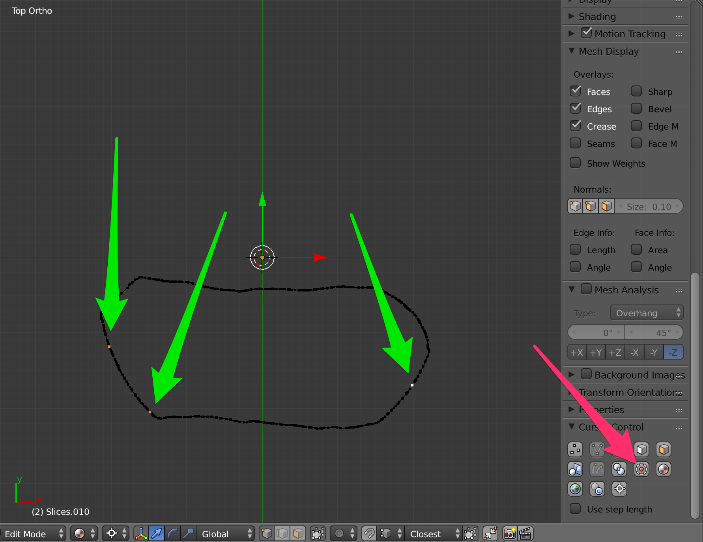

# BlenderAddons4CH
Addons Blender for Cultural Heritage

## Table of contents

1. [Sites where to find add-ons](#sites_addons)
    1. [Official Blender Add-ons](#sites_official)
2. [Texture Painting](#texture_painting)
3. [Vertex Painting](#vertex_painting)
4. [Sculpting](#sculpting)
5. [Materials](#materials)
6. [PBR materials and painting with Blender and FOSS ecosystem around it](#pbr_materials)
7. [Speed up Modelling tasks e modellazione procedurale](#speedup_modelling)
8. [UV mapping tools](#uv_mapping_tools)
9. [Enhance 3D space interface](#potenziare_interfaccia)
10. [Baking tools](#baking_tools)
11. [Integration with photogrammetry and 3DSGS](#fotogrammetria_integrazione)
12. [Compositor](#compositor)
13. [Multi-user](#multi_user)
14. [Landscape Management](#gestione_paesaggi)
15. [Camera and Rendering (static and video)](#camera_rendering)
16. [Animation](#animation)
17. [Connection to external libraries](#connessione_librerie)
18. [Code Snippets](#code_snippets)
19. [Beautiful themes for Blender](#temi_belli)
20. [Startup file and configuration](#startup_file)
21. [Paying](#acquistati)
22. [Simulation](#simulation)
23. [Exporter/Importer](#exporter_importer)
24. [2D plans and sections: derived data creation](#derived_data)

## 1. Sites where to find add-ons 

### Official Blender Add-ons 

http://wiki.blender.org/index.php/Extensions:2.6
Collection with animated gif description and external links for download
http://blenderaddonlist.blogspot.it/
Github search based on keywords: Blender eand Pyhton (+1700 add-ons)
https://github.com/search?l=Python&q=blender&type=Repositories&utf8=%E2%9C%93
Highlight of the best 12 add-ons out there (not so complete and questionable but usefull)
http://www.blenderguru.com/articles/12-useful-blender-addons-everyone-should-use/

## 2. Texture Painting 

- Tool for brush library: [Download](https://www.dropbox.com/s/2tr64y6w7sgolr7/vtools_libraryManager.py?dl=0)
- Texture from Image
- Texture Paint plus: Originally written by Bart Crouch (author of the sketchfab exporter, among other things) and later supplemented by two other artists and developers, it is a useful tool for painting in Blender. [Download](https://github.com/artistCDMJ/texture_paint_plus/archive/master.zip)
- Texture Presets: excellent add-on for quickly creating images with known size in the power of two (1024-2048-4096)
- Zero Brush: old version of zero brush (when there was no charge for the stand-alone version, now to use it you have to get the whole blender sensei-free but VERY invasive)
- Brushes: brushes to be imported in "append" mode from the blend file included here [Download](https://github.com/xrg81/brushes)
Tool for brush library[!]
https://www.dropbox.com/s/2tr64y6w7sgolr7/vtools_libraryManager.py?dl=0

## 3. Vertex Painting 

- Oscurart worn edges
Add-on for painting the colour per vertex of meshes at wear areas of a model (exposed edges etc.). Great for creating wear maps.

- Slope
Sostituire il gruppo di vertici attivo o il livello di colore dei vertici con valori che rappresentano la pendenza di una faccia (si trova ora anche in Blender GIS)
versione 2 dello stesso (?)

- Transpal
Brilliant tool for vertex painting based on visual rules and palettes (also from Gimp)

## 4. Sculpting 

- Sculpt Brushes
Pratica raccolta di pennelli per lo sculpting (si installa dentro Blender e si abilita con un bottone)
- Space view brush: Con alt+v hai a disposizione tutti i comandi di sculpting

## 5.Materials 

- Matalogue: [Website](http://adaptivesamples.com/2015/08/04/introducing-matalogue/)

- Display material relations

- Material Converter
Material converter from Blender internal (including GLSL materials such as photoscan) to cycles (deprecated in the latest version, can be found in Blender Sensei, in a paid add-on called zero-brush, present in this list in its old, non-paid version - under painting)

## 6.PBR materials and painting with Blender and FOSS ecosystem around it 

- Realtime visualization and editing of PBR materials
Blender PBR branch by Cément Foucalt -  http://www.clement-foucault.com/
now it is in the 2.8 development branch

Materials
Addon per materiale PBR
Shader easyPBR - https://cgcookiemarkets.com/all-products/pbr-material-node/
UE4Shader - 
Shader Library - 
PBR material taking in mind substance material editor (but it works well with all kind of metallic-roughtness pipeline - 
BR Node V1.5
PBR fatto da me seguendo Cynicat
Blender Brit (seguendo indicazioni di Cynicat e Blender Guru)
http://www.blenderbrit.co.uk/free-tool-pbr-node-pack/
Mega Shader by Stefano Scarioni CC-BY
http://www.stefanoscarioni.com/en/2016/06/13/mega-shader-2/
Tesi di laurea su PBR in Blender -  Sairiala 2015  PBR workflows in Cycles Render Engine ( Bachelor’s thesis)

FOSS ecosystem around Blender to improve paint/sculpt/PBR pipeline in Blender
Xnormal - www.xnormal.net/ - open source, baker efficiente da hipoly a low poly di MOLTE mappe (WIN), un pò lento (l'opzione CUDA che dovrebbe renderlo VELOCISSIMO mi crasha), (WIN).
Awesome Bump - http://awesomebump.besaba.com/ - open source, permette di elaborare mappe metallic e roughtness (PBR-metallic flavour) in modalità automatica o semi-automatica, (MAC, WIN, LINUX). Crasha con mappe di 8192 :-(
HDRluminance - qtpfsgui.sourceforge.net - open source, utile per fare hdr a partire da panorami con diversa esposizione (MAC, WIN, LINUX).
parallels with closed software solutions at  PBR pipeline improvement

## 7.Speed up Modelling tasks e modellazione procedurale 

- np_station: [Forum Thread](https://blenderartists.org/t/addon-np-station/686462)

- Materiale per sezionare: [Blog Post](https://blendbits.blogspot.it/2017/02/the-cutaway-shader-free-blender-add-on.html)
- Mesh align plus: [Releases](https://github.com/egtwobits/mesh-align-plus/releases)

Selective unhide
https://github.com/RayMairlot/Selective-Unhide 

- Snap advanced

- Drop to Ground
Drop selected objects on active object

- Planarizer
Corrects non-planar quads/ metti su uno stesso piano le facce selezionate (in base alla normale mediana delle facce)

- Rotation Constrained

- To create circumferences from three points

- Object cross section
Creates cross section(s) of the selected object(s) using the active object as cut plane
- Laser Slicer 0.7
Makes a series of cross-sections and exports an svg file for laser cutting
- Intersection
Adds to the mesh of active object its intersection with another mesh object

Retopology tools

Hard surface modelling
https://masterxeon1001.com/2016/05/28/box-cutter-4-update-notes/

Blender Carver

Blender Rebool
Blender addon Boolean Booltron
Bool tool
strumento per booleane dirette oltre che tramite modificatore (non utilissimo..)
https://github.com/vitorbalbio/code

http://www.blendernation.com/2016/03/03/calculating-distances-two-points-using-geodesic-paths/

Sverchok
Potentissimo sistema a nodi per modellare in modo procedurale
https://github.com/nortikin/sverchok

Genera tavole del pavimento

Modular tree
ottimo addon per creare alberi procedurali. alla sua terza versione
https://github.com/MaximeHerpin/modular_tree/releases

## 8. UV mapping tools 

- TexTools for Blender: [Bitbucket](https://bitbucket.org/renderhjs/textools-blender/)
- Sure UV: Tool per fare UV mapping rapido per l'architettura
https://developer.blender.org/F18724
http://blenderartists.org/forum/showthread.php?236631-Addon-Simple-Box-UVW-Map-Modifier

- Magic UV: [GitHub](https://github.com/nutti/Magic-UV): Bel tool per la modifica degli UV, una feature interessante è il boundin-box nello spazio UV
https://github.com/nutti/Magic-UV

- Move UV
Move the UV from 3D view

- UV squares (da github)
https://www.youtube.com/watch?v=oklmDQx17HI&feature=youtu.be
https://github.com/Radivarig/UvSquares/
variante:

- Multi-object UV edit
lo fa anche texture atlas, questo è più “diretto”
https://github.com/ndee85/Multi-Object-UV-Editing

## 9. Potenziare interfaccia spazio 3D 

- Mesh snap utilities line

- Screencast

- Vari tool fra cui Gestore dei Modificatori

- Enhanced 3D cursor

- Shading menu in header

- Measure it
https://github.com/Antonioya/blender/tree/master/measureit
Add dimension
Setta la lunghezza di un edge in modo arbitrario

- Amaranth toolset
http://pablovazquez.org/amaranth/

- Rename

- Vertex Index Viewer:
http://wiki.blender.org/index.php/Extensions:2.6/Py/Scripts/3D_interaction/Index_Visualiser

is key free fid a key free for shortcut

Apply Shape keys

Miscellanea di tool
https://github.com/lapineige/Blender_add-ons.git

## 10.Baking tools 

Multibake
Bakes selected object into individual maps

Meltdown
Improved baking UI meltdown

Texture Atlas
tra gli autori campell barton (non ho capito se è nella versione ufficiale di Blender, spero di si)

## 11.Integrazione con la fotogrammetria 

- 3dsc

- QuipCAM
Blender OSL shader per modellare dentro allo spazio 3D panorami 360

- Import bundler 0.3 format
import del file bundle.out proveniente da bundler (ne esiste una mia versione modificata che mantiene anche i nomi delle camere - fatta per Enzo)

- Panorama Tracker
tool per stabilizzare video 360 
https://github.com/dfelinto/Panorama-Tracker

io mesh xyz
Importare ed esportare un file con triplette di posizione (e generare una nuvola di punti)
http://wiki.blender.org/index.php/Extensions:2.6/Py/Scripts/Import-Export/XYZ

3D Gaussian Splatting (Added 2024-03-05)
Able to import 3DGS dataset and create visualizations (slow with large scenes)
https://github.com/ReshotAI/gaussian-splatting-blender-addon

Photogrammetry Importer (added 2024-03-24)
Ottimo software per importare soluzioni fotogrammetriche
https://github.com/SBCV/Blender-Addon-Photogrammetry-Importer

## 12.Compositor 

- Blenderquick compositor: tools for rapid compositing in Blender [Website](http://www.blenderbrit.co.uk/quickcompositor/)

*EasyFX
eccezionale strumento per il post processing di immagini appena renderizzate
http://www.rymdnisse.net/download/blender-addons/easyfx/

Photo Editing tool
utilizzare i nodi per l’editing di immagini dentro a Blender (pannello aggiuntivo nel compositor)

Color Ramp Dropper
intelligente sistema per campionare una serie di valori colore per una color ramp a partire da una immagine
https://blenderartists.org/forum/showthread.php?401806-Addon-v1-2-ColorRamp-Dropper-easily-select-color-values-for-ColorRamp-nodes&p=3071567#post3071567
https://github.com/qwenger/BAddons/tree/master/Node_ColorRampDropper

## 13.Multi-user work in Blender 

Verse 2
server + client per modellare a distanza nello stesso spazio 3D
https://github.com/verse/verse-blender 

## 14.Landscape Management 

Blender GIS
https://github.com/domlysz/BlenderGIS.git

Vegetazione (erba)
http://www.3d-wolf.com/grass.html
https://docs.google.com/document/d/11FmIygEY8BRU9tL9_hGOFVhUN9igcQ9lOoAYffn54cY/edit

LOD generation for terrains
http://hugobarreira.weebly.com

Sun position

Osg Export
https://github.com/cedricpinson/osgexport

## 15. Camera and Rendering (statico e video) 

Real Camera
Effetti per il rendering realistico
http://3dwolf.weebly.com/camera.html

CameraImagePlan
Script per creare un piano di proiezione in camera

Blender video directly taken from the OpenGL viewport
http://lollypopman.com/2016/03/30/add-on-advanced-boomsmash/

Girare la telecamera
Script per creare una camera che ruota intorno ad un oggetto
https://github.com/Antonioya/blender

## 16.Animation 

Blender-power-sequencer
Blender's video sequencer has a lot of potential, but it lacks essential tools for content creators to edit videos efficiently.
https://github.com/GDquest/Blender-power-sequencer.git

Blender Animation Nodes
ottimo add-on per aggiungere un sistema di animazione a nodi (eccezionale)
si trova su GitHub:  https://github.com/JacquesLucke/animation_nodes

Keyframes quick tools

Flip animation

VSE logging system

Particle morphing tools (deprecated in last versions)

## 17.Connection to external libraries 

Blender Cloud texture
Add-on per usare out of the box le texture da Blender Cloud (richiede account Blender ID e subscription)

Blend library
https://wiki.blender.org/index.php/Extensions:2.6/Py/Scripts/Import-Export/Blend_Library
variante (?)

## 18.Coding 

Importer XML

Code autocomplete
ottimo addon per sviluppare addon
https://github.com/JacquesLucke/code_autocomplete/releases/tag/code_autocomplete_v2a

## 19.Temi belli per Blender 

## 19.Startup file and configuration 

(to be copied in C:\Users\[USER]\AppData\Roaming\Blender Foundation\Blender\2.77\config

## 21. Non free 

ProLightSkies:  ottimo per fare illuminazione di esterni foto-realistica)
Color master: ottimo addon per color correction, ha una ricca sezione di thumbnails per fare fast preview delle configurazioni.
RetopoFlow: fantastico (e costoso) addon per fare retopo di geometrie. Eccezionale, ha una serie di tutorial (+300Mb)

14 dicembre 2016 
Asset Sketcher: addon che permette di dipingere geometrie su altre geometrie (ad esempio alberi su terreno) velocizzando il workflow
Baketools: Strumenti di Bake avanzato che rendono veloce e preciso il task
Eibriel Linker: addon per gestire risorse in linking, buono ma vuole il suo particolare settaggio. Lo sviluppatore dorme un po’ )gli chiedo funzionalità da mesi..)
Gaffer: FANTASTICO tool per il light tuning
Lodscape: Immaturo ma utile sistema per creare livelli di dettaglio automatici nei paesaggi (funziona con mesh topologicamente corrette, ad esempio create da dem o da instant mesh)

Pacchetto ottimo di materiali per la pelle (fotorealistico)
Ottimo addon per modificare le UV di una geometria
Dipinge il peso dei vertici in base a regole
Sistema ingenioso per avere il livelli di dettaglio dentro a cycles (ottimizzazione fantastica di scena)
Capsule permette di esportare gruppi di oggetti in fbx seguendo delle regole

Ottimo addon per visualizzare le geometrie nascoste dietro ad alre geometrie (fantastico durante l'editing poligonale di oggetti)
Shader per Allegoritmic
bpainter: monumentale addon per Blender

## 22. Simulation.  
Modeling-Cloth
ottimo add-on per modellare e simulare tessuti
https://github.com/the3dadvantage/Modeling-Cloth

Ocupe Projectors
Ottimo add-on pr simulare la proiezione su superfici nello spazio 3D
https://github.com/Ocupe/Projectors

## 23. Exporter/Importer.  
https://github.com/KhronosGroup/glTF-Blender-Exporter
http://renderhjs.net/fbxbundle/

## 24. 2D plans and sections: derived data creation.  

MeasureIt_ARCH is an addon for Blender, that adds tools to create design documentation and technical drawings that can be previewed within Blender's 3D viewport, and exported as images, vector graphics or .dxf files.
https://github.com/kevancress/MeasureIt_ARCH?tab=readme-ov-file